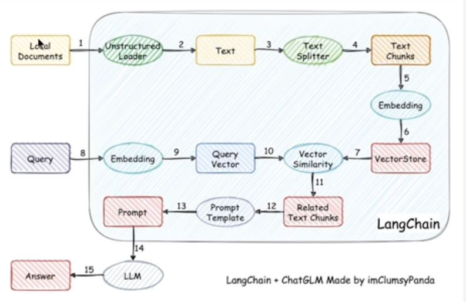
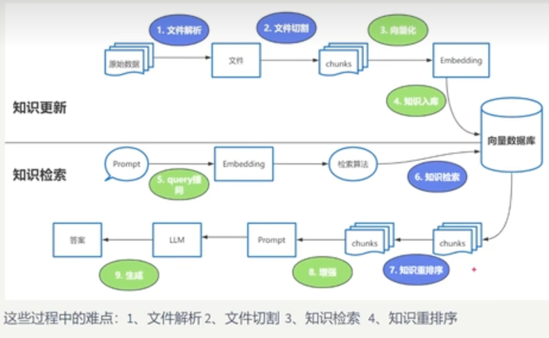
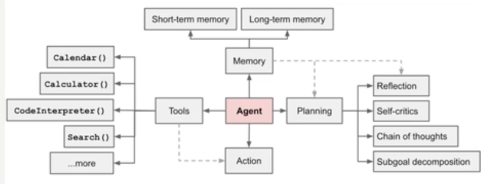
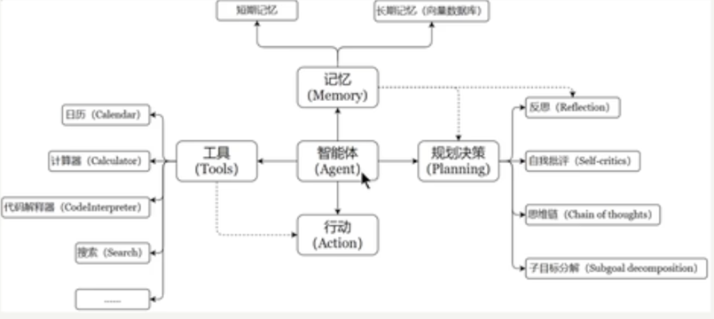
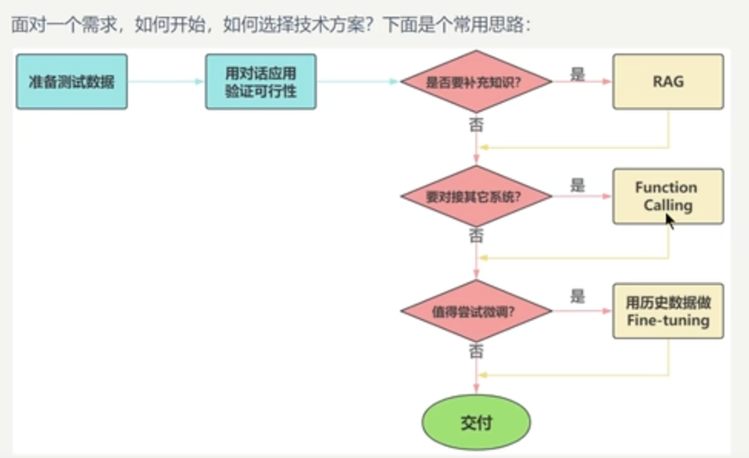
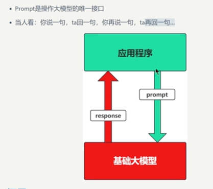
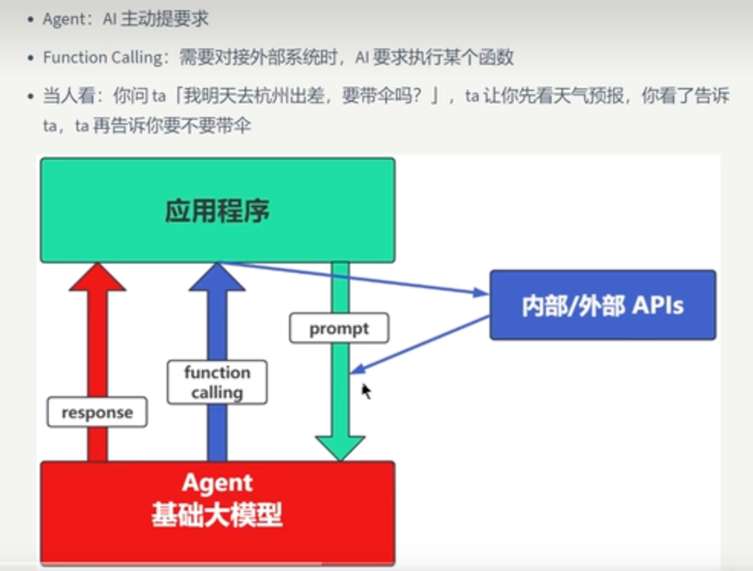
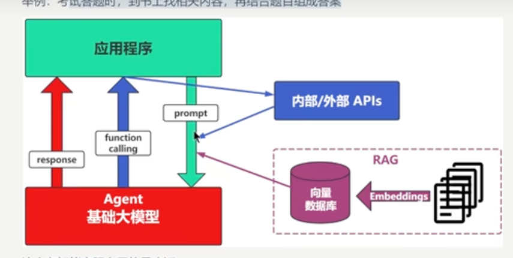
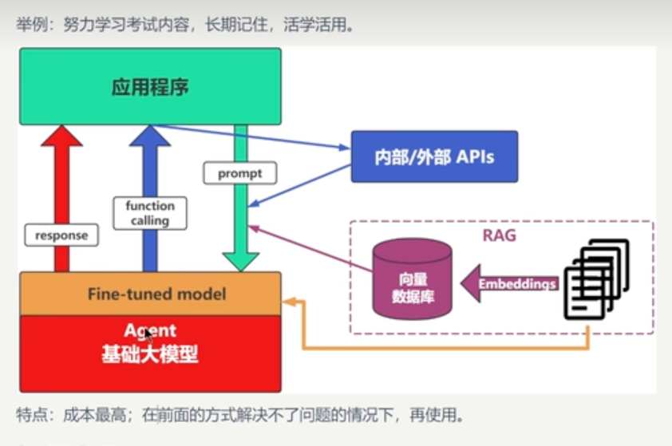

# 大模型Agent开发学习

## 智能体开发的两种架构
### 基于RAG架构开发

#### RAG原理图


#### agent RAG流程


### 基于Agent架构开发

#### agent架构




短期记忆： 就是类似上下文会话，文件记录的上下文，每次模型都要根据你传递的上下文进行学习思考；memory文件
长期记忆: 就是通过微调大模型，让大模型自己记住相关的知识点，不用依赖上下文；


## 智能体开发的几种场景


### 纯Promt



### Agent+functionCalling



### RAG 场景


### Fine-tuning（精调/微调）



## Lanchain的核组件

## LangChain + LangGraph + LangSmith 

### 一、核心定位与关系

这三个项目共同构成了一个完整的 AI 应用开发与运维生态，其关系可以概括为：

```
LangChain = Build（构建）
LangGraph = Run（运行）
LangSmith = Monitor & Scale（监控与扩展）
```

它们之间的架构关系是分层的：**LangChain 的最新版本（1.0+）是构建在 LangGraph 之上的**。这意味着 LangGraph 提供了更底层的、强大的工作流编排能力，而 LangChain 则在此基础上提供了更高阶的抽象和易用的组件库。

### 二、各组件详解

#### **LangChain**

*   **定位**: 基础框架与组件库（积木）。
*   **核心价值**: 提供了一套模块化的、标准化的组件，用于快速构建 LLM 应用。它解决了“如何编写”AI 应用的问题。
*   **主要功能**:
    *   **统一接口**: 兼容 OpenAI, Anthropic, 百度, 阿里等多种大模型。
    *   **Prompt 工程**: 将提示词模板化、结构化，便于管理和优化。
    *   **组件模块化**: 提供 `Models`, `Prompts`, `Chains`, `Memory`, `Retrieval`, `Tools` 等即插即用的组件。
    *   **RAG 实现**: 简化检索增强生成（Retrieval-Augmented Generation）的开发流程。
*   **适用场景**: 快速原型验证、简单的问答系统、线性工作流。

#### **LangGraph**

*   **定位**: 图结构工作流编排引擎（施工图）。
*   **核心价值**: 提供了基于有向图（DAG）的状态机来编排复杂的、非线性的 Agent 工作流。它解决了“如何运行”复杂逻辑的问题。
*   **关键能力**:
    *   **图结构**: 支持条件分支、循环和跳转，可以实现“反思-重试”、“规划-执行”等高级模式。
    *   **状态管理 (State)**: 内置强大的状态管理，允许不同节点之间传递和修改共享状态。
    *   **持久化 (Checkpoints)**: 可以保存和恢复执行过程中的检查点，实现长时间运行和中断后恢复。
    *   **原生支持人机协作**: 可以在流程中插入人工审核环节，并从中断处继续执行。
*   **适用场景**: 复杂的客服系统、多步骤数据分析、需要循环迭代的代码审查 Agent。

#### **LangSmith**

*   **定位**: 可观测性与评估平台（监控中心）。
*   **核心价值**: 为生产环境的 AI 应用提供调试、监控、测试和优化的能力。它解决了“如何优化和维护”AI 应用的问题。
*   **核心功能**:
    *   **追踪 (Tracing)**: 记录每一次 LLM 调用、工具使用和链式执行的完整日志，可视化整个执行流程。
    *   **监控 (Monitoring)**: 实时监控 API 调用次数、延迟、错误率和 Token 消耗。
    *   **评估 (Evaluation)**: 对不同的 Prompt、模型或 RAG 策略进行 A/B 测试，量化比较其效果。
    *   **调试 (Debugging)**: 当输出不符合预期时，可以精确地定位到是哪个环节出了问题。
*   **适用场景**: 生产环境部署、性能瓶颈分析、Prompt 效果优化。

### 三、选型建议

| 场景 | 推荐技术 |
| :--- | :--- |
| **学习入门，快速搭建 MVP** | 从 LangChain 开始 |
| **简单问答、文档摘要** | LangChain 原生 Chain |
| **复杂决策、条件判断、循环** | LangGraph |
| **生产级应用，需要监控和优化** | LangChain + LangGraph + LangSmith 三者结合 |


尚硅谷LangChain教程，langchain实战快速入门  ？集

## LangChain 六大核心模块

根据 LangChain 官方定义，其核心架构由以下六大模块构成，是构建所有 LLM 应用的基础：

### 1. Models（模型）


*   **作用**: LLM 应用的“大脑”，负责理解和生成语言。
*   **类型**:
    *   **LLMs (大语言模型)**: 如 GPT-4, Claude Opus，擅长自由文本生成。
    *   **Chat Models (对话模型)**: 专为多轮对话优化，能更好地处理上下文消息（如 `HumanMessage`, `SystemMessage`）。
*   **核心价值**: 提供统一的接口，使开发者可以轻松地在不同提供商（OpenAI, Anthropic, Gemini 等）和不同类型的模型间切换，而无需重写大量业务逻辑。

### 2. Prompts（提示）


*   **作用**: 引导和约束模型行为的指令，是控制模型输出质量的关键。
*   **核心功能**:
    *   **Prompt Templates**: 将动态变量（如用户输入）嵌入到固定的指令模板中，实现可复用和可管理的提示工程。
    *   **Few-Shot Learning**: 在提示中加入少量示例（Input/Output pairs），引导模型模仿特定的格式和风格。
*   **重要性**: “Garbage in, garbage out.”，高质量的 Prompt 是高质量输出的前提。

### 3. Chains（链）


*   **作用**: 将多个独立的组件（如模型调用、工具使用、数据处理）串联成一个完整的、有序的工作流。
*   **实现方式**:
    *   **LCEL (LangChain Expression Language)**: 使用管道符 `|` 声明式地组合组件，是官方推荐的现代语法，支持流式输出和并行执行。
    *   **SequentialChain**: 将多个子链按顺序执行，前一个链的输出作为下一个链的输入。
*   **典型应用**: RAG（检索 -> 注入上下文 -> 生成回答）、聊天机器人（接收输入 -> 查询知识库 -> 生成回复）。

### 4. Agents（代理）


*   **作用**: 能够自主思考、规划和行动的智能体，可以根据任务目标，动态决定调用哪些工具以及调用顺序。
*   **工作原理**:
    *   **感知**: 接收用户输入和当前环境信息。
    *   **规划**: LLM 分析任务，决定下一步行动（如“我需要搜索一下这个问题”）。
    *   **行动**: 执行选定的工具（Tool Calling）。
    *   **观察**: 获取工具执行结果。
    *   **循环**: 将结果反馈给 LLM，重复上述过程直到任务完成。
*   **核心组件**: `AgentExecutor` 负责协调 LLM 和 Tools 的交互。

### 5. Memory（记忆）


*   **作用**: 为 LLM 应用提供短期或长期的记忆能力，使其能够进行多轮对话和上下文相关的响应。
*   **常用类型**:
    *   **ConversationBufferMemory**: 最简单的形式，将所有历史对话消息存储在一个缓冲区中。
    *   **ConversationSummaryMemory**: 使用另一个 LLM 自动总结长篇对话历史，避免因上下文过长而超出模型限制。
    *   **VectorStoreRetrieverMemory**: 将对话历史向量化存储，通过相似性检索相关的历史片段，实现更智能的上下文召回。
*   **应用场景**: 聊天机器人、个人助手。

### 6. Retrieval（检索）


*   **作用**: 解决 LLM 的“知识盲区”和“幻觉”问题，通过引入外部知识源来增强模型的生成能力（RAG - Retrieval-Augmented Generation）。
*   **核心流程**:
    1.  **加载 (Load)**: 使用 Document Loaders 从 PDF、网页、数据库等来源读取原始数据。
    2.  **切分 (Split)**: 使用 Text Splitters 将大文档分割成适合处理的小块（chunks）。
    3.  **向量化 (Embed)**: 使用 Embeddings 模型将文本块转换为高维向量。
    4.  **存储 (Store)**: 将向量存入 Vector Stores（如 FAISS, Pinecone）以便快速检索。
    5.  **检索 (Retrieve)**: 当用户提问时，在向量库中查找最相关的文本块，并将其作为上下文注入到 Prompt 中。
*   **核心价值**: 使得 LLM 能够基于最新的、私有的或特定领域的知识进行回答，极大地提升了准确性和实用性。


尚硅谷LangChain教程，langchain实战快速入门  9集8:15