# 大模型Agent开发学习

## 智能体开发的两种架构
### 基于RAG架构开发

#### RAG原理图
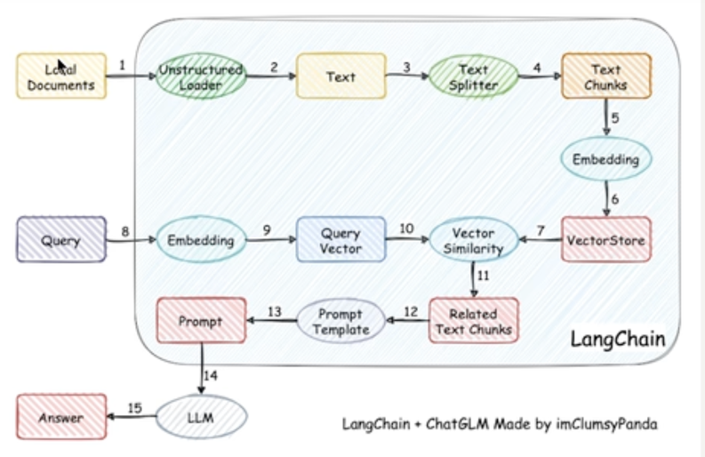

#### agent RAG流程
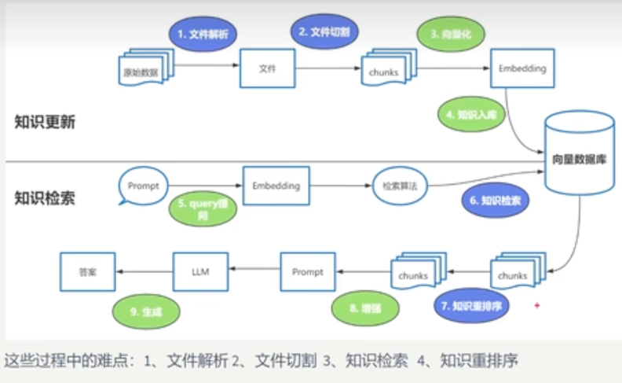

### 基于Agent架构开发

#### agent架构
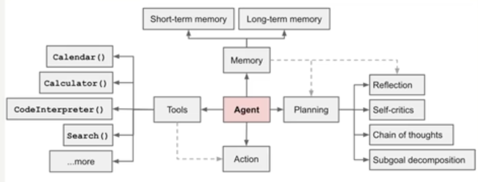

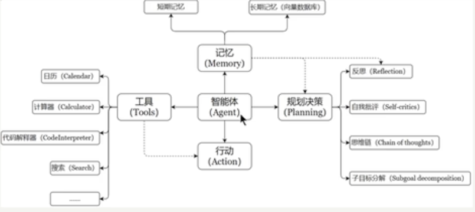

短期记忆： 就是类似上下文会话，文件记录的上下文，每次模型都要根据你传递的上下文进行学习思考；memory文件
长期记忆: 就是通过微调大模型，让大模型自己记住相关的知识点，不用依赖上下文；


## 智能体开发的几种场景
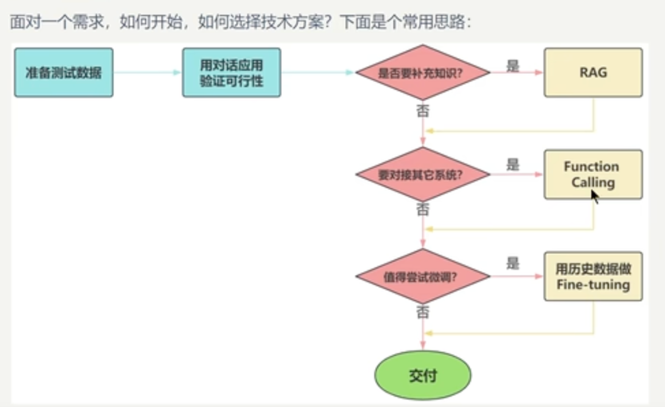

### 纯Promt
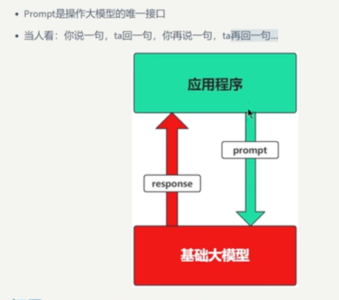


### Agent+functionCalling
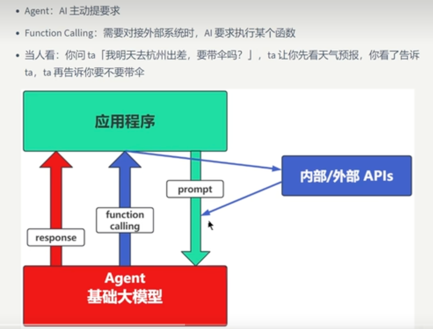


### RAG 场景
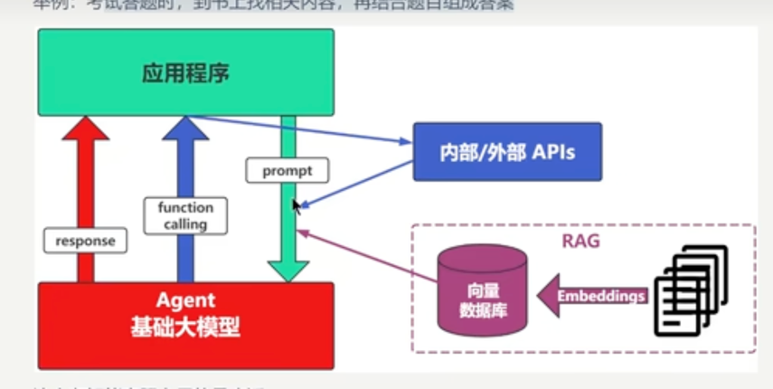

### Fine-tuning（精调/微调）
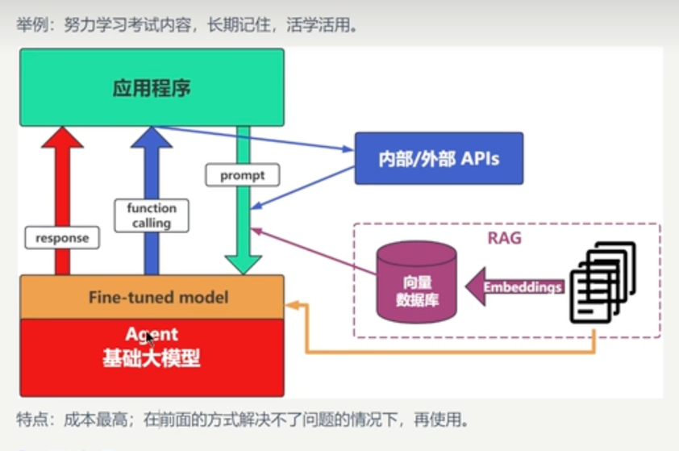


## lanchain 开发框架

### Lanchain的核心组件 LangChain + LangGraph + LangSmith 

#### 一、核心定位与关系

这三个项目共同构成了一个完整的 AI 应用开发与运维生态，其关系可以概括为：

```
LangChain = Build（构建）
LangGraph = Run（运行）
LangSmith = Monitor & Scale（监控与扩展）
```

它们之间的架构关系是分层的：**LangChain 的最新版本（1.0+）是构建在 LangGraph 之上的**。这意味着 LangGraph 提供了更底层的、强大的工作流编排能力，而 LangChain 则在此基础上提供了更高阶的抽象和易用的组件库。

#### 二、各组件详解

##### **LangChain**

*   **定位**: 基础框架与组件库（积木）。
*   **核心价值**: 提供了一套模块化的、标准化的组件，用于快速构建 LLM 应用。它解决了“如何编写”AI 应用的问题。
*   **主要功能**:
    *   **统一接口**: 兼容 OpenAI, Anthropic, 百度, 阿里等多种大模型。
    *   **Prompt 工程**: 将提示词模板化、结构化，便于管理和优化。
    *   **组件模块化**: 提供 `Models`, `Prompts`, `Chains`, `Memory`, `Retrieval`, `Tools` 等即插即用的组件。
    *   **RAG 实现**: 简化检索增强生成（Retrieval-Augmented Generation）的开发流程。
*   **适用场景**: 快速原型验证、简单的问答系统、线性工作流。

##### **LangGraph**

*   **定位**: 图结构工作流编排引擎（施工图）。
*   **核心价值**: 提供了基于有向图（DAG）的状态机来编排复杂的、非线性的 Agent 工作流。它解决了“如何运行”复杂逻辑的问题。
*   **关键能力**:
    *   **图结构**: 支持条件分支、循环和跳转，可以实现“反思-重试”、“规划-执行”等高级模式。
    *   **状态管理 (State)**: 内置强大的状态管理，允许不同节点之间传递和修改共享状态。
    *   **持久化 (Checkpoints)**: 可以保存和恢复执行过程中的检查点，实现长时间运行和中断后恢复。
    *   **原生支持人机协作**: 可以在流程中插入人工审核环节，并从中断处继续执行。
*   **适用场景**: 复杂的客服系统、多步骤数据分析、需要循环迭代的代码审查 Agent。

##### **LangSmith**

*   **定位**: 可观测性与评估平台（监控中心）。
*   **核心价值**: 为生产环境的 AI 应用提供调试、监控、测试和优化的能力。它解决了“如何优化和维护”AI 应用的问题。
*   **核心功能**:
    *   **追踪 (Tracing)**: 记录每一次 LLM 调用、工具使用和链式执行的完整日志，可视化整个执行流程。
    *   **监控 (Monitoring)**: 实时监控 API 调用次数、延迟、错误率和 Token 消耗。
    *   **评估 (Evaluation)**: 对不同的 Prompt、模型或 RAG 策略进行 A/B 测试，量化比较其效果。
    *   **调试 (Debugging)**: 当输出不符合预期时，可以精确地定位到是哪个环节出了问题。
*   **适用场景**: 生产环境部署、性能瓶颈分析、Prompt 效果优化。

#### 三、选型建议

| 场景 | 推荐技术 |
| :--- | :--- |
| **学习入门，快速搭建 MVP** | 从 LangChain 开始 |
| **简单问答、文档摘要** | LangChain 原生 Chain |
| **复杂决策、条件判断、循环** | LangGraph |
| **生产级应用，需要监控和优化** | LangChain + LangGraph + LangSmith 三者结合 |

### LangChain 六大核心模块

根据 LangChain 官方定义，其核心架构由以下六大模块构成，是构建所有 LLM 应用的基础：

#### 1. Models（模型）


*   **作用**: LLM 应用的“大脑”，负责理解和生成语言。
*   **类型**:
    *   **LLMs (大语言模型)**: 如 GPT-4, Claude Opus，擅长自由文本生成。
    *   **Chat Models (对话模型)**: 专为多轮对话优化，能更好地处理上下文消息（如 `HumanMessage`, `SystemMessage`）。
*   **核心价值**: 提供统一的接口，使开发者可以轻松地在不同提供商（OpenAI, Anthropic, Gemini 等）和不同类型的模型间切换，而无需重写大量业务逻辑。

#### 2. Prompts（提示）


*   **作用**: 引导和约束模型行为的指令，是控制模型输出质量的关键。
*   **核心功能**:
    *   **Prompt Templates**: 将动态变量（如用户输入）嵌入到固定的指令模板中，实现可复用和可管理的提示工程。
    *   **Few-Shot Learning**: 在提示中加入少量示例（Input/Output pairs），引导模型模仿特定的格式和风格。
*   **重要性**: “Garbage in, garbage out.”，高质量的 Prompt 是高质量输出的前提。

#### 3. Chains（链）


*   **作用**: 将多个独立的组件（如模型调用、工具使用、数据处理）串联成一个完整的、有序的工作流。
*   **实现方式**:
    *   **LCEL (LangChain Expression Language)**: 使用管道符 `|` 声明式地组合组件，是官方推荐的现代语法，支持流式输出和并行执行。
    *   **SequentialChain**: 将多个子链按顺序执行，前一个链的输出作为下一个链的输入。
*   **典型应用**: RAG（检索 -> 注入上下文 -> 生成回答）、聊天机器人（接收输入 -> 查询知识库 -> 生成回复）。

#### 4. Agents（代理）


*   **作用**: 能够自主思考、规划和行动的智能体，可以根据任务目标，动态决定调用哪些工具以及调用顺序。
*   **工作原理**:
    *   **感知**: 接收用户输入和当前环境信息。
    *   **规划**: LLM 分析任务，决定下一步行动（如“我需要搜索一下这个问题”）。
    *   **行动**: 执行选定的工具（Tool Calling）。
    *   **观察**: 获取工具执行结果。
    *   **循环**: 将结果反馈给 LLM，重复上述过程直到任务完成。
*   **核心组件**: `AgentExecutor` 负责协调 LLM 和 Tools 的交互。

#### 5. Memory（记忆）


*   **作用**: 为 LLM 应用提供短期或长期的记忆能力，使其能够进行多轮对话和上下文相关的响应。
*   **常用类型**:
    *   **ConversationBufferMemory**: 最简单的形式，将所有历史对话消息存储在一个缓冲区中。
    *   **ConversationSummaryMemory**: 使用另一个 LLM 自动总结长篇对话历史，避免因上下文过长而超出模型限制。
    *   **VectorStoreRetrieverMemory**: 将对话历史向量化存储，通过相似性检索相关的历史片段，实现更智能的上下文召回。
*   **应用场景**: 聊天机器人、个人助手。

#### 6. Retrieval（检索）


*   **作用**: 解决 LLM 的“知识盲区”和“幻觉”问题，通过引入外部知识源来增强模型的生成能力（RAG - Retrieval-Augmented Generation）。
*   **核心流程**:
    1.  **加载 (Load)**: 使用 Document Loaders 从 PDF、网页、数据库等来源读取原始数据。
    2.  **切分 (Split)**: 使用 Text Splitters 将大文档分割成适合处理的小块（chunks）。
    3.  **向量化 (Embed)**: 使用 Embeddings 模型将文本块转换为高维向量。
    4.  **存储 (Store)**: 将向量存入 Vector Stores（如 FAISS, Pinecone）以便快速检索。
    5.  **检索 (Retrieve)**: 当用户提问时，在向量库中查找最相关的文本块，并将其作为上下文注入到 Prompt 中。
*   **核心价值**: 使得 LLM 能够基于最新的、私有的或特定领域的知识进行回答，极大地提升了准确性和实用性。

### langchain Model I/O
modelIO是与语言模型交互的核心组件，在整个框架中有很重要的地位。
包括输入提示（format）、调用模型（Predict）、输出解析（Parse），分别对应着Prompt Template， Model， output parser
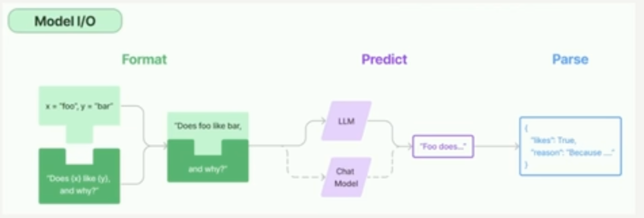

#### 模型调用的分类

角度1: 按照模型的功能  

（1）非对话模型（LLMS， Text Model）
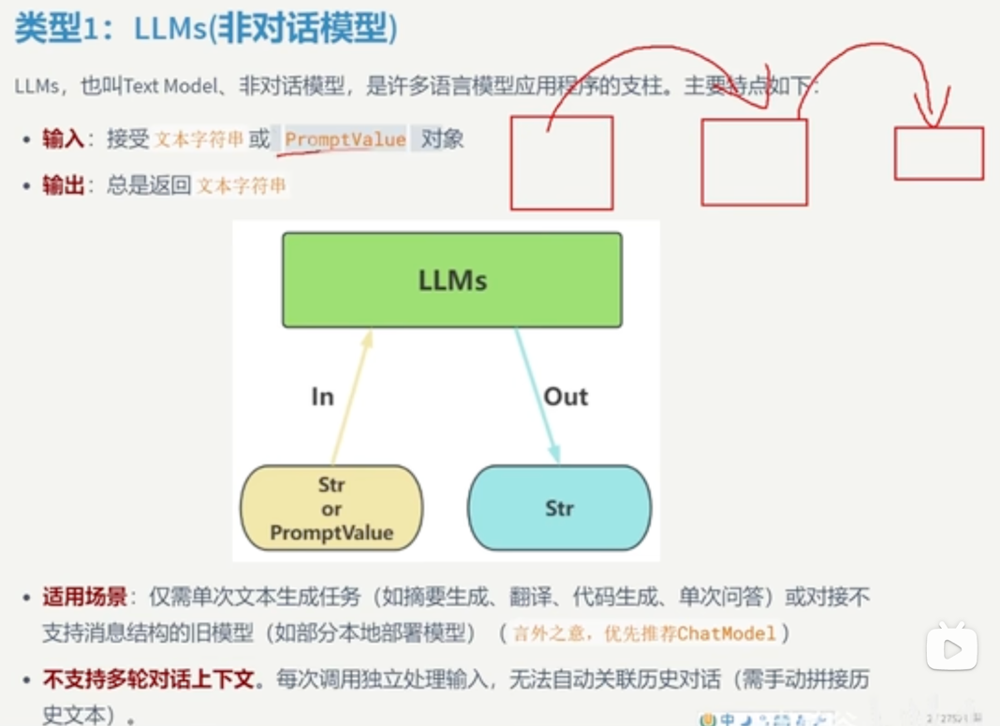
（2）对话模型（Chat Model）  
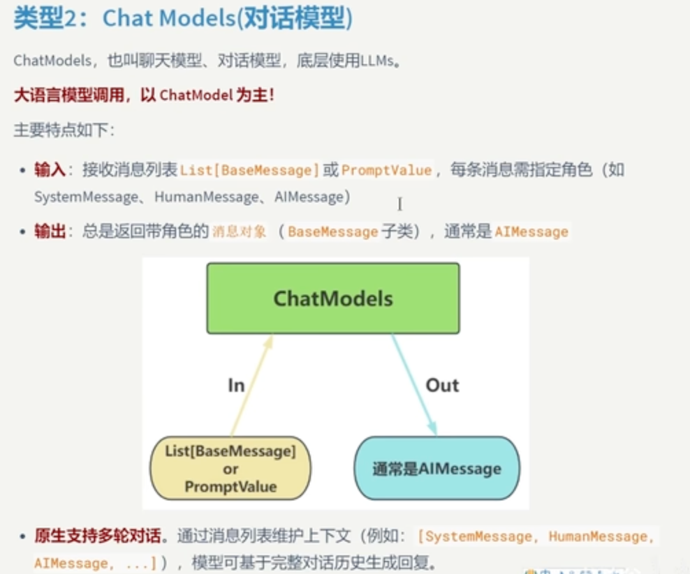
（3）嵌入型（embedding Model）
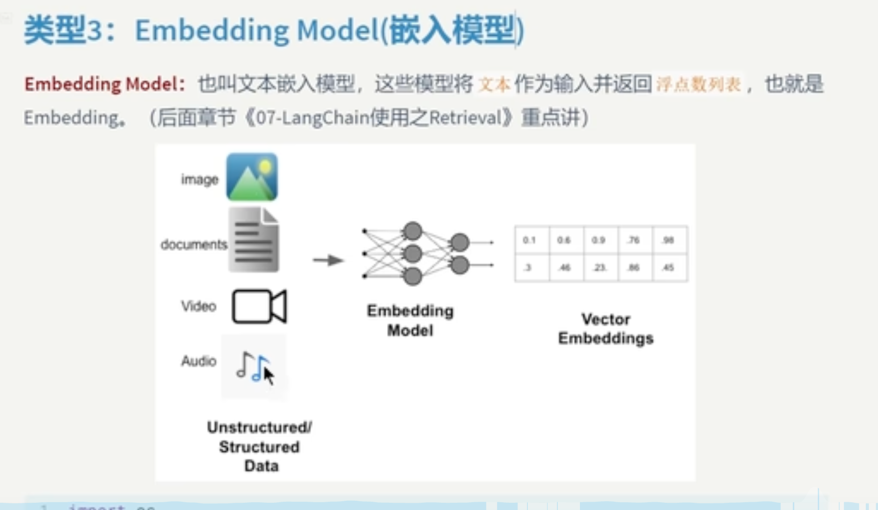

角度2: 按照模型调用时，参数书写的位置不同（api-key base-url model）  
硬编码：  
环境变量：  
配置文件：  

角度3: 具体api的调用  
LangChain的API  

OpenAI官方的API  

其他平台提供的API  


#### AI Message类型
（1）SystemMessage  
（2）HumanMessage  
（3）AIMessage  
（4）FunctionMessage  
（5）ToolMessage  
（6）ChatMessage  


#### 多轮对话和上下文记忆
模型本身没有上下文记忆，需要借助我们维护的消息体列表


#### 阻塞调用 流调用 批量调用 异步盗用

#### 提示词模板

**有几种不同类型的提示模板：**

**1. PromptTemplate（LLM 提示模板）**

LLM 提示模板，用于**生成字符串提示**。它使用 Python 的字符串来模板提示。

```python
from langchain_core.prompts import PromptTemplate

# 使用 Python 字符串模板
prompt = PromptTemplate.from_template(
    "请解释{concept}是什么，并给出{num}个例子。"
)

# 格式化提示
formatted = prompt.format(concept="机器学习", num=3)
# 输出：请解释机器学习是什么，并给出 3 个例子。
```

**2. ChatPromptTemplate（聊天提示模板）**

聊天提示模板，用于**组合各种角色的消息模板**，传入聊天模型。

```python
from langchain_core.prompts import ChatPromptTemplate

# 组合不同角色的消息
prompt = ChatPromptTemplate.from_messages([
    ("system", "你是一个{role}，擅长{skill}"),
    ("human", "你好，我想了解{topic}"),
    ("ai", "好的，我来为你解释{topic}"),
    ("human", "{followup_question}")
])

# 格式化
messages = prompt.format_messages(
    role="AI 助手",
    skill="解释复杂概念",
    topic="量子计算",
    followup_question="它和经典计算有什么区别？"
)
```

**3. XxxMessagePromptTemplate（消息模板模板）**

消息模板的模板，包括：
- `SystemMessagePromptTemplate` - 系统消息模板
- `HumanMessagePromptTemplate` - 用户消息模板  
- `AIMessagePromptTemplate` - AI 消息模板
- `ChatMessagePromptTemplate` - 聊天消息模板

```python
from langchain_core.prompts import ChatPromptTemplate, SystemMessagePromptTemplate, HumanMessagePromptTemplate

# 系统消息模板
system_message_prompt = SystemMessagePromptTemplate.from_template(
    "你是一个{role}。"
)

# 用户消息模板
human_message_prompt = HumanMessagePromptTemplate.from_template(
    "{user_input}"
)

# 组合使用
chat_prompt = ChatPromptTemplate.from_messages([
    system_message_prompt,
    human_message_prompt
])
```

**4. FewShotPromptTemplate（样本提示词模板）**

样本提示词模板，通过**示例来教模型如何回答**（Few-shot Learning）。

```python
from langchain_core.prompts import FewShotPromptTemplate, PromptTemplate

# 定义示例
examples = [
    {
        "question": "谁是美国第一位总统？",
        "answer": "乔治·华盛顿"
    },
    {
        "question": "谁是法国第一位皇帝？",
        "answer": "拿破仑·波拿巴"
    }
]

# 定义示例模板
example_template = PromptTemplate(
    input_variables=["question", "answer"],
    template="问题：{question}\n答案：{answer}"
)

# 创建少样本提示模板
prompt = FewShotPromptTemplate(
    examples=examples,
    example_prompt=example_template,
    suffix="问题：{new_question}\n答案：",
    input_variables=["new_question"]
)

# 格式化
formatted = prompt.format(new_question="谁是中国第一位皇帝？")
```

**5. PipelinePrompt（管道提示词模板）**

管道提示词模板，用于**把几个提示词组合在一起使用**，前一个的输出作为后一个的输入。

```python
from langchain_core.prompts import PipelinePromptTemplate, PromptTemplate

# 定义多个提示模板
prompt1 = PromptTemplate.from_template("请总结：{text}")
prompt2 = PromptTemplate.from_template("请翻译以下内容为英文：{summary}")

# 创建管道
pipeline = PipelinePromptTemplate(
    prompts=[
        ("summary", prompt1),
        ("translation", prompt2)
    ]
)
```

**6. 自定义模板**

允许**基于其它模板类来定制自己的提示词模板**。

```python
from langchain_core.prompts import PromptTemplate

class CustomPromptTemplate(PromptTemplate):
    """自定义提示模板"""
    
    def __init__(self, *args, **kwargs):
        super().__init__(*args, **kwargs)
        # 添加自定义逻辑
        self.custom_prefix = "[自定义] "
    
    def format(self, **kwargs):
        # 在格式化前添加自定义处理
        formatted_text = super().format(**kwargs)
        return self.custom_prefix + formatted_text

# 使用自定义模板
custom_prompt = CustomPromptTemplate(
    template="请解释{concept}",
    input_variables=["concept"]
)

result = custom_prompt.format(concept="量子纠缠")
# 输出：[自定义] 请解释量子纠缠
```
---

#### 输出解析器（Output Parsers）

**概念**：

语言模型返回的内容通常都是字符串的格式（文本格式），但在实际 AI 应用开发过程中，往往希望 model 可以返回**更直观、更格式化的内容**，以确保应用能够顺利进行后续的逻辑处理。此时，LangChain 提供的**输出解析器**就派上用场了。

**作用**：

输出解析器（Output Parser）负责**获取 LLM 的输出并将其转换为更合适的格式**。这在应用开发中及其重要。

---

** 输出解析器的分类**

LangChain 有许多不同类型的输出解析器：

**1. StrOutputParser（字符串解析器）**

最基础的解析器，直接返回字符串。

```python
from langchain_core.output_parsers import StrOutputParser

parser = StrOutputParser()

# 解析 AI 消息
response = AIMessage(content="这是一个测试回答")
result = parser.invoke(response)
print(result)  # 输出：这是一个测试回答
```

**2. JsonOutputParser（JSON 解析器）**

JSON 解析器，确保输出符合特定 JSON 对象格式。

```python
from langchain_core.output_parsers import JsonOutputParser
from langchain_core.prompts import PromptTemplate

parser = JsonOutputParser()

prompt = PromptTemplate(
    template="请提取以下文本的关键信息：\n{text}\n\n{format_instructions}",
    input_variables=["text"],
    partial_variables={"format_instructions": parser.get_format_instructions()}
)

# 使用
formatted_prompt = prompt.format(text="苹果公司成立于 1976 年，创始人是 Steve Jobs。")
response = llm.invoke(formatted_prompt)
result = parser.invoke(response)
# 输出：{"company": "苹果公司", "founded": "1976", "founder": "Steve Jobs"}
```

**3. XMLOutputParser（XML 解析器）**

XML 解析器，允许以流行的 XML 格式从 LLM 获取结果。

```python
from langchain_core.output_parsers import XMLOutputParser

parser = XMLOutputParser()

prompt = PromptTemplate(
    template="请描述{animal}：\n{format_instructions}",
    input_variables=["animal"],
    partial_variables={"format_instructions": parser.get_format_instructions()}
)

# 使用
formatted_prompt = prompt.format(animal="猫")
response = llm.invoke(formatted_prompt)
result = parser.invoke(response)
# 输出：<description><name>猫</name><type>哺乳动物</type>...</description>
```

**4. CommaSeparatedListOutputParser（CSV 解析器）**

CSV 解析器，模型的输出以逗号分隔，以列表形式返回输出。

```python
from langchain_core.output_parsers import CommaSeparatedListOutputParser

parser = CommaSeparatedListOutputParser()

prompt = PromptTemplate(
    template="列出{topic}的三个例子：\n{format_instructions}",
    input_variables=["topic"],
    partial_variables={"format_instructions": parser.get_format_instructions()}
)

# 使用
formatted_prompt = prompt.format(topic="水果")
response = llm.invoke(formatted_prompt)
result = parser.invoke(response)
# 输出：['苹果', '香蕉', '橙子']
```

**5. DatetimeOutputParser（日期时间解析器）**

日期时间解析器，可用于将 LLM 输出解析为日期时间格式。

```python
from langchain_core.output_parsers import DatetimeOutputParser
from datetime import datetime

parser = DatetimeOutputParser()

prompt = PromptTemplate(
    template="{question}\n{format_instructions}",
    input_variables=["question"],
    partial_variables={"format_instructions": parser.get_format_instructions()}
)

# 使用
formatted_prompt = prompt.format(question="中华人民共和国什么时候成立的？")
response = llm.invoke(formatted_prompt)
result = parser.invoke(response)
# 输出：datetime.datetime(1949, 10, 1)
print(type(result))  # <class 'datetime.datetime'>
```

**6. PydanticOutputParser（Pydantic 解析器）**

使用 Pydantic 模型定义输出结构，更强大的类型检查。

```python
from langchain_core.output_parsers import PydanticOutputParser
from pydantic import BaseModel, Field

# 定义输出结构
class Country(BaseModel):
    name: str = Field(description="国家名称")
    capital: str = Field(description="首都")
    population: int = Field(description="人口数量（万）")

parser = PydanticOutputParser(pydantic_object=Country)

prompt = PromptTemplate(
    template="请提供{country}的信息：\n{format_instructions}",
    input_variables=["country"],
    partial_variables={"format_instructions": parser.get_format_instructions()}
)

# 使用
formatted_prompt = prompt.format(country="中国")
response = llm.invoke(formatted_prompt)
result = parser.invoke(response)
# 输出：Country(name='中国', capital='北京', population=140000)
print(result.name)  # 访问属性
```

**7. RetryOutputParser（重试解析器）**

用于处理解析失败时的重试逻辑。

```python
from langchain_core.output_parsers import RetryOutputParser
from langchain_core.prompts import PromptTemplate

# 当解析失败时，使用这个解析器生成重试提示
parser = RetryOutputParser.from_llm(
    llm=llm,
    original_parser=JsonOutputParser()
)

# 如果原始解析失败，会自动生成重试提示
result = parser.parse_with_prompt(llm_response, prompt)
```

---

**使用场景对比**：

| 解析器 | 返回类型 | 适用场景 |
|--------|----------|----------|
| StrOutputParser | `str` | 普通文本输出 |
| JsonOutputParser | `dict` | 结构化数据提取 |
| XMLOutputParser | `xml` | XML 格式输出 |
| CommaSeparatedListOutputParser | `list` | 列表形式输出 |
| DatetimeOutputParser | `datetime` | 日期时间解析 |
| PydanticOutputParser | `BaseModel` | 复杂结构化数据 |
| RetryOutputParser | 任意 | 错误处理和重试 |

---

**最佳实践**：

1. ✅ **选择合适的解析器**：根据应用需求选择
   ```python
   # 需要结构化数据 → JsonOutputParser
   # 需要列表 → CommaSeparatedListOutputParser
   # 需要日期 → DatetimeOutputParser
   ```

2. ✅ **使用 format_instructions**：让模型知道如何格式化
   ```python
   prompt = PromptTemplate(
       template="{question}\n{format_instructions}",
       input_variables=["question"],
       partial_variables={"format_instructions": parser.get_format_instructions()}
   )
   ```

3. ✅ **添加错误处理**：解析可能失败
   ```python
   try:
       result = parser.invoke(response)
   except OutputParserException as e:
       print(f"解析失败：{e}")
       # 使用重试解析器或降级处理
   ```

4. ✅ **组合使用**：可以链式组合多个解析器
   ```python
   chain = prompt | llm | StrOutputParser() | json.loads
   ```

5. ✅ **定义清晰的 Schema**：使用 Pydantic 定义复杂结构
   ```python
   class Product(BaseModel):
       name: str
       price: float
       description: str
   ```

---


#### Chain 的基本概念

**Chain（链）**：链，用于将多个组件（提示模板、LLM 模型、记忆、工具等）连接起来，形成可复用的**工作流**，完成复杂的任务。

**Chain 的核心思想**是通过组合不同的模块化单元，实现比单一组件更强大的功能。比如：

- 将 **LLM** 与 **Prompt Template**（提示模板）结合
- 将 **LLM** 与 **输出解析器** 结合
- 将 **LLM** 与 **外部数据** 结合，例如用于问答
- 将 **LLM** 与 **长期记忆** 结合，例如用于聊天历史记录
- 通过将 **第一个 LLM 的输出作为第二个 LLM 的输入**，...，将多个 LLM 按顺序结合在一起

---

**为什么需要 Chain？**

单个 LLM 组件功能有限，通过 Chain 可以：
1. ✅ **组合能力**：整合多个组件的优势
2. ✅ **复用性**：一次定义，多次使用
3. ✅ **模块化**：每个组件独立开发和测试
4. ✅ **灵活性**：轻松替换或升级某个组件
5. ✅ **复杂任务**：处理需要多步骤的复杂场景

---

**Chain 的类型**：
1. **Sequential Chain**：顺序执行多个组件，每个组件的输出作为下一个组件的输入。
2. **Conditional Chain**：根据条件执行不同的组件。
3. **Loop Chain**：循环执行多个组件，直到满足条件。
4. **Multi-Agent Chain**：多个代理执行多个组件，每个代理处理不同的任务。
5. **Tool Chain**：将工具与 LLM 组合，实现基于工具进行任务的处理。
6. **Custom Chain**：自定义链，实现自定义的链式结构。
7. **Hybrid Chain**：混合链，将多个链组合在一起，实现更复杂的任务处理。
8. **Hyperparameter Optimization Chain**：超参数优化链，用于优化模型参数。
9. **React Chain**：React 链，用于处理基于 React 的任务。
10. **Graph Chain**：图链，用于处理基于图数据库的任务。
11. **Multi-Modal Chain**：多模态链，用于处理多模态数据。
12. **Multi-Agent Chain**：多代理链，用于处理多代理任务。
13. **Multi-Task Chain**：多任务链，用于处理多任务。
14. 数学链  
15. 路由链  
16. 文档链  

#### Memory 记忆能力
模型本身是没有记忆能力的，但是可以通过**记忆**来保存模型执行过程中所处理的信息，从而实现**长时记忆**。
实现这个记忆功能，就需要额外的模块去保存我们和模型对话的上下文信息，然后在下一次请求时，把所有的历史信息都输入给模型，让模型输出最终结果。  
而在 LangChain 中，提供这个功能的模块就称为 Memory（记忆），用于存储用户和模型交互的历史信息。  


**agent 基于 memeory 调用 LLM 的原理图**

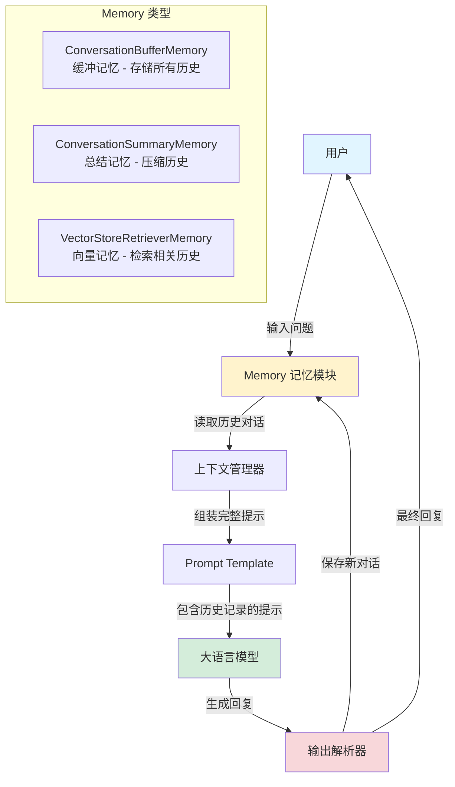
```mermaid
graph TB
    User[用户] -->|输入问题 | Memory[Memory 记忆模块]
    Memory -->|读取历史对话 | Context[上下文管理器]
    Context -->|组装完整提示 | Prompt[Prompt Template]
    Prompt -->|包含历史记录的提示 | LLM[大语言模型]
    LLM -->|生成回复 | Output[输出解析器]
    Output -->|最终回复 | User
    Output -->|保存新对话 | Memory
    
    subgraph Memory 类型
        M1[ConversationBufferMemory<br/>缓冲记忆 - 存储所有历史]
        M2[ConversationSummaryMemory<br/>总结记忆 - 压缩历史]
        M3[VectorStoreRetrieverMemory<br/>向量记忆 - 检索相关历史]
    end
    
    style User fill:#e1f5ff
    style Memory fill:#fff3cd
    style LLM fill:#d4edda
    style Output fill:#f8d7da
```

**🎯 实战 Demo**: 查看 [`demo/demo-memory/custom_memory_demo.py`](demo/demo-memory/custom_memory_demo.py) - 包含三种自定义记忆实现的完整示例

---

## LangGraph 和 LangSmith 示例

### LangGraph 示例 (demo4-langGraph)

LangGraph 是用于构建有状态、多参与者应用的图结构工作流编排引擎。

**示例文件：**
- [langgraph_example.py](demo/demo4-langGraph/langgraph_example.py) - 基础线性工作流示例
- [langgraph_conditional_example.py](demo/demo4-langGraph/langgraph_conditional_example.py) - 条件分支工作流示例

**运行示例：**
```bash
# 运行基础工作流
python demo/demo4-langGraph/langgraph_example.py

# 运行条件分支示例
python demo/demo4-langGraph/langgraph_conditional_example.py
```

**安装依赖：**
```bash
pip install langgraph
```

**详细说明：** 查看 [demo4-langGraph/README.md](demo/demo4-langGraph/README.md)

### LangSmith 示例 (demo5-langSmith)

LangSmith 是 LangChain 的开发平台，用于追踪、调试、测试和监控 LLM 应用。

**示例文件：**
- [langsmith_example.py](demo/demo5-langSmith/langsmith_example.py) - LangSmith 追踪示例

**运行示例：**
```bash
# 配置环境变量后运行
python demo/demo5-langSmith/langsmith_example.py
```

**安装依赖：**
```bash
pip install langchain-openai langchain-core
```

**配置步骤：**
1. 在 [https://smith.langchain.com](https://smith.langchain.com) 注册账号
2. 获取 API Key
3. 复制 `.env.example` 为 `.env` 并填写配置
4. 运行示例

**详细说明：** 查看 [demo5-langSmith/README.md](demo/demo5-langSmith/README.md)

### 统一运行器

提供了一个交互式运行器来运行所有示例：

```bash
python demo/run_examples.py
```

---

---尚硅谷LangChain教程，langchain实战快速入门  47集1:47